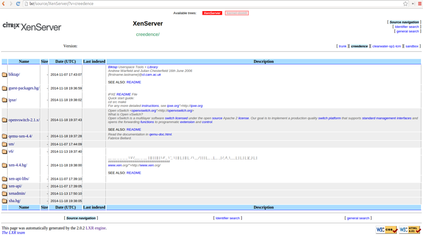

Indexing all repos used by XenServer requires a few hours, hence this set of scripts run off a cronjob.
The scripts implement:
* Fetch repos using the XenServer build system (not OSS)
* Fetch repos from git repos
* invoke [genxref](http://lxr.sourceforge.net/en/index.shtml)

##Installation
* Install [LXR](http://lxr.sourceforge.net/en/index.shtml)
* Apply [XenServer patches ](https://github.com/philippegabriel/lxr)

##File list
* `run.sh` Top level script called by cron
* `crontab` cron job
* `CTXSbuild-clone.sh` Fetch repos, using XenServer build system
* `gitclone.sh` Initial fetch of git repos 
* `gitpull.sh` Fetch git repos
* `gitrepos.csv` - List of git repos to pull
* `xenserver-targets.csv` List of XenServer Build system targets/release to sync
* `kernel-dom0-targets.csv` List of XenServer (kernel-dom0) Build system target/releases to sync
* `webalizer.conf` [customised webalizer config file](ftp://ftp.mrunix.net/pub/webalizer/sample.conf) 
* `webalizer.www.conf` customised webaliser apache config file
* `crontab.webalizer` 

##Configuration 
* Install XenServer build system (if available)
* Identify extra git repos to sync
* Customise `*.csv` files, to index required components/repos/releases
* Schedule cron job

##Webalizer configuration
* Edit `webalizer.conf` if needed, then mv to `/etc/webalizer/`
* Edit `webalizer.www.conf` if needed, then mv to `/etc/apache2/conf.d`, then restart apache
* Schedule cron job (needs root), `sudo crontab crontab.webalizer`

Usage stats, should then be available at: http://lxr/stats
